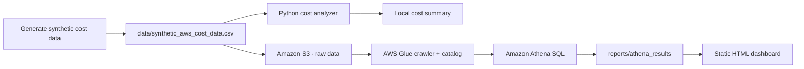
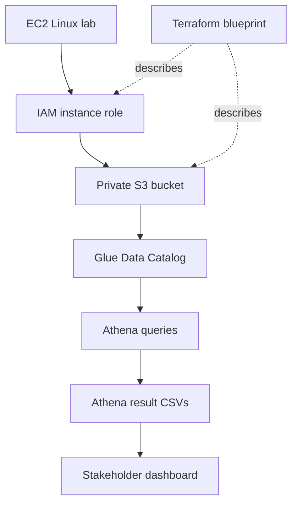

# MediBill Cloud Cost & Governance Dashboard

MediBill is a portfolio project about a problem that shows up in a lot of cloud environments: the bill is growing, but it is hard to explain where the money is going. I created a synthetic cost dataset for a fictional medical billing company, analyzed it with Python, moved the workflow into S3/Glue/Athena, and turned the results into a dashboard that a non-technical stakeholder could actually read.

There is no real patient information, billing information, or protected health information in this project. The medical-billing setting is only used to make the cost and governance questions more realistic.

## Project flow



The AWS workflow was practiced as a lab, while the checked-in local files make the analysis reproducible without needing an AWS account.

## What the project answers

- Which AWS services account for the most cost?
- Which departments are driving spend?
- Which resources are missing ownership or cost-center tags?
- Which idle, oversized, or poorly tiered resources are the best savings opportunities?

The dashboard turns those questions into a small set of charts, summary cards, and tables. A preview is available at [`screenshots/medibill_static_dashboard.png`](screenshots/medibill_static_dashboard.png), and the generated dashboard is [`dashboard/medibill_dashboard.html`](dashboard/medibill_dashboard.html).

## Current sample results

The checked-in dataset contains 150 synthetic records. Running the local workflow currently produces:

| Measure | Result |
| --- | ---: |
| Modeled monthly AWS cost | $43,265.00 |
| Estimated monthly savings | $10,773.00 |
| Untagged resources | 28 |
| Largest service cost | EC2 ($10,716.00) |
| Largest department cost | Billing Operations ($12,863.00) |

These numbers are modeled examples, not a real AWS bill. Generating a new dataset intentionally changes the totals.

## Run it locally

From the project directory:

```sh
python3 scripts/analyze_costs.py
python3 scripts/build_static_dashboard.py
open dashboard/medibill_dashboard.html
```

The analyzer reads the CSV in `data/` and refreshes `reports/cost_summary_report.txt`. The dashboard reads the result files in `reports/athena_results/` and rebuilds the HTML file.

To create a new synthetic dataset first:

```sh
python3 scripts/generate_fake_cost_data.py
python3 scripts/analyze_costs.py
python3 scripts/build_static_dashboard.py
```

## AWS and infrastructure pieces

The project also documents a small AWS lab workflow:



The EC2 lab used an IAM role instead of storing access keys on the instance. The Terraform directory describes the S3 bucket, public-access block, EC2 role, least-privilege S3 policy, and instance profile. It is intentionally an unapplied blueprint because the original lab resources were created manually.

## Repository guide

- [`scripts/analyze_costs.py`](scripts/analyze_costs.py) — calculates costs, savings, tag gaps, and recommendations
- [`scripts/build_static_dashboard.py`](scripts/build_static_dashboard.py) — builds the stakeholder-facing HTML dashboard
- [`queries/athena_finops_queries.sql`](queries/athena_finops_queries.sql) — SQL questions used for the FinOps analysis
- [`docs/aws_s3_setup.md`](docs/aws_s3_setup.md) — S3 storage workflow
- [`docs/glue_crawler_setup.md`](docs/glue_crawler_setup.md) — Glue crawler and catalog workflow
- [`docs/athena_query_results_summary.md`](docs/athena_query_results_summary.md) — what the queries found
- [`docs/ec2_linux_lab.md`](docs/ec2_linux_lab.md) — EC2, IAM, Linux, and S3 lab notes
- [`docs/terraform_notes.md`](docs/terraform_notes.md) — Terraform scope and safety notes

## Scope

This is a learning and portfolio project, not a production medical billing system. The dashboard is static and has no authentication. It should stay local or be placed behind an access-controlled hosting layer before being shared with real business data. It also does not claim HIPAA compliance.

## Why I built it

I wanted one project that showed more than a dashboard screenshot. The useful part for me was working through the whole path: shaping data, writing analysis logic, asking business questions in SQL, using AWS services, thinking about IAM, and then explaining the results clearly to someone who does not want to read a query.
